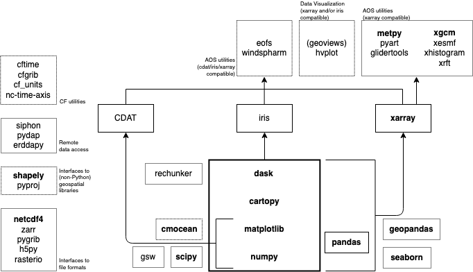

The Python for Atmosphere and Ocean Science (PyAOS) website and mailing list was established almost a decade ago to provide information and resources to the user community. In order to keep the site up-to-date, the first ever PyAOS census was launched in May 2021. There were 144 participants in the survey, allowing for a detailed analysis of how Python is being used by those working and studying in the weather, ocean and climate sciences.

# Summary

Census respondents were overwhelmingly male (75%), young (74% are under 40) and based in the USA (57%).
They had typically been using Python for at least two years (82%) and were self-taught (mainly from Stack Overflow).
Only 30% reported having attended a Python workshop of any kind and only 19% encountered Python during university.
Almost all respondents primarily work with raster (i.e. gridded) data stored in netCDF format,
but older (GRIB) and newer (Zarr) raster formats were also widely used (35% and 26% of respondents, respectively).
About half of respondents also do at least some work with vector data, typically in the form of Shapefiles.
Two-thirds of people indicated that they do at least some of their analysis on a supercomputer
(e.g. hosted by their institution or a national facility) and one-third on the cloud (e.g. Amazon Web Services),
but over half said a personal computer is still the platform they most commonly use for data science.
Jupyter was the most popular development environment by a wide margin, with a quarter of respondents listing no other IDE or text editor.
In terms of specific Python libraries, xarray dominates the PyAOS stack.
It has a much larger user base than competing general purpose PyAOS libraries (iris and CDAT)
and most of the new libraries entering the stack build upon the xarray DataArray.
So far there has been little take up of libraries that allow for interactive (as opposed to static)
data exploration/visualisation (e.g. geoviews, hvplot),
while the use of libraries that test code (e.g. unittest) or parse the command line (e.g. argparse) is rare.
A clear inference from the survey is that most data processing workflows are coordinated exclusively from a Jupyter notebook.

TODO: Caption

TODO: Caption

# Detailed results 

### Demographics

Age?

| Age group | # |
| :-- | :-- |
| 20-29 | 45 |
| 30-39 | 60 |
| 40-49 | 23 |
| 50-59 | 10 |
| 60-69 | 4 |

Gender: How do you identify?

| Gender | # |
| :-- | :-- |
| Man | 106 |
| Woman | 35 |
| Non-binary | 1 |

Country of residence?

| Country | # |
| :-- | :-- |
| United States | 82 |
| Australia | 23 |
| Great Britain | 9 |
| India | 5 |
| Brazil | 3 |
| Sweden | 2 |
| China | 2 |

Plus one respondent from each of Austria, Canada, South Korea, Netherlands, Germany, New Zealand, Spain, Taiwan, Chile and Finland.

Primary AOS discipline/s (select all that apply)

TODO

### Python usage

How long have you been using Python? 

| Time | # |
| :-- | :-- |
| Less than 1 year | 16 |
| 1-2 years | 10 |
| 2-5 years | 54 |
| 6-10 years | 42 |
| More than 10 years | 21 |

How have you learned Python?

| Method | % |
| :-- | :-- |
| Self taught (from textbooks, online tutorials, etc) | 90.140845 |
| Workshop/s (e.g. Carpentries, Unidata) | 29.577465 |
| University semester course/s (e.g. "Introduction to Programming") | 19.014085 |
| University degree (e.g. Bachelor of Software Engineering) | 5.633803 |

### Data

What types of AOS data do you work with (select all that apply)?

| Data type | % |
| :-- | :-- |
| Raster data | 97.857143 |
| Tabular data | 61.428571 |
| Vector data | 50.000000 |

Which do you most commonly work with?

| Data type | # |
| :-- | :-- |
| Raster data | 109 |
| Tabular data | 21 |
| Vector data | 6 |

### File formats

What file formats are your AOS data stored in?

| Format | | 
| :-- | :-- |
| netCDF | 141 |
| CSV | 92 |
| GRIB  | 49 |
| Shapefile | 41 |
| HDF | 40 |
| Zarr | 37 |
| GeoTIFF | 33 |
| GeoJSON | 21 |
| A custom binary format | 18 |

There were also a small number of responses for GeoPackage (5), ICARTT (3), ESRI File Geodatabase (3), SQL (2), Plain text (ASCII) (2), NPY (1), JSON (1), Video (1), SQLite (1), MAT (1), Images (1), Relational Database (1), GeoParquet (1) and Audio (1).

Which format do you most commonly work with?

| Format | |
| :-- | :-- |
| netCDF | 100 |
| CSV | 14 |
| Zarr | 11 |
| GRIB | 7 |
| Shapefile | 3 |
| HDF | 2 |
| GeoJSON | 1 |
| ICARTT | 1 |
| A custom binary format | 1 |
| JSON | 1 |

### Platforms

What computing platforms do you use for your AOS data science?

| Computing platform | | 
| :-- | :-- |
| Personal laptop/desktop | 128 |
| Supercomputer (e.g. run by your institution or a national facility) | 91 |
| Cloud (e.g. Amazon Web Services) | 45 |
| Local server (e.g. provided by your department) | 6 |

Which platform do you most commonly work on for your AOS data science?

| Computing platform | |
| :-- | :-- |
| Personal laptop/desktop | 81 |
| Supercomputer | 46 |
| Cloud | 8 |
| Local server | 3 |

What development environments do you regularly use for your Python coding?

| Environment | |
| :-- | :-- |
| Jupyter | 118
| Vim | 50 |
| VSCode | 24 |
| Spyder | 22 |
| PyCharm | 19 |
| Atom | 10 |
| Sublime Text | 9 |
| Notepad ++ | 7 |
| Emacs | 6 |
| bbedit | 1 |
| gedit | 1 |
| Google Colab | 1 |

### Libraries

Writing Python code typically begins with importing various libraries that are either part of the Python standard library or that you've installed using the Python package installer (pip) or conda. Take a look back over five Python scripts / notebooks that you've written recently for AOS data science tasks and cut and paste below all the import statements that you used in those scripts / notebooks (please remove any duplicates).

| Core Library | % |
| :-- | :-- |
| numpy | 85.7 |
| matplotlib | 79.3 |
| xarray | 69.3 |
| pandas | 52.1 |
| cartopy | 50.0
| dask | 19.3 |
